# MitM Data Aggregator - Screenshots

Diese Seite zeigt die wichtigsten Ansichten des MitM Data Aggregator Admin Frontends.

## Dashboard und Informationen

### Dashboard

Das Dashboard bietet einen aktuellen Überblick über Systemzustand, Scheduler-Version,
Datenbank, geplante Jobs sowie die Anzahl der vorhandenen Protokolle und Fehler.

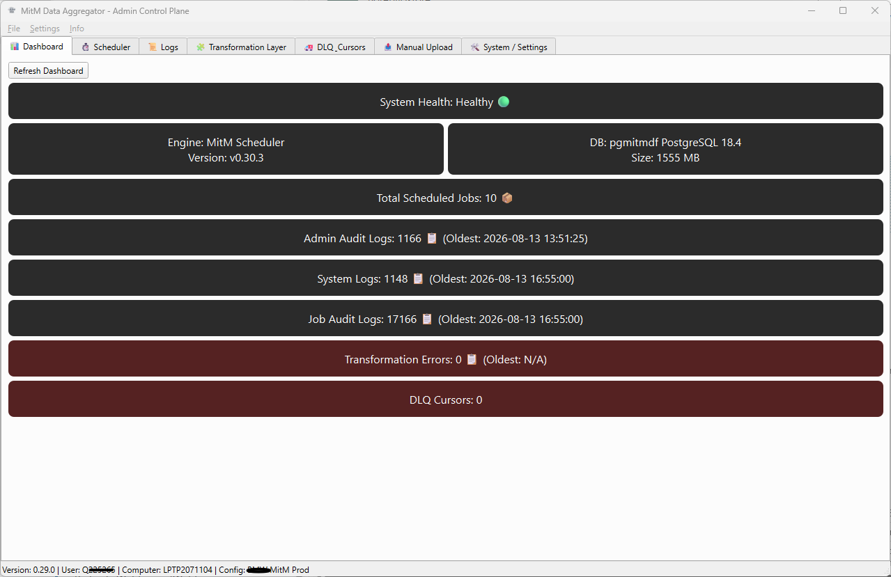

### Netzwerk-Proxy

Über die Netzwerkeinstellungen kann ein HTTP/HTTPS-Proxy einschließlich Port und
Anmeldedaten aktiviert und konfiguriert werden.

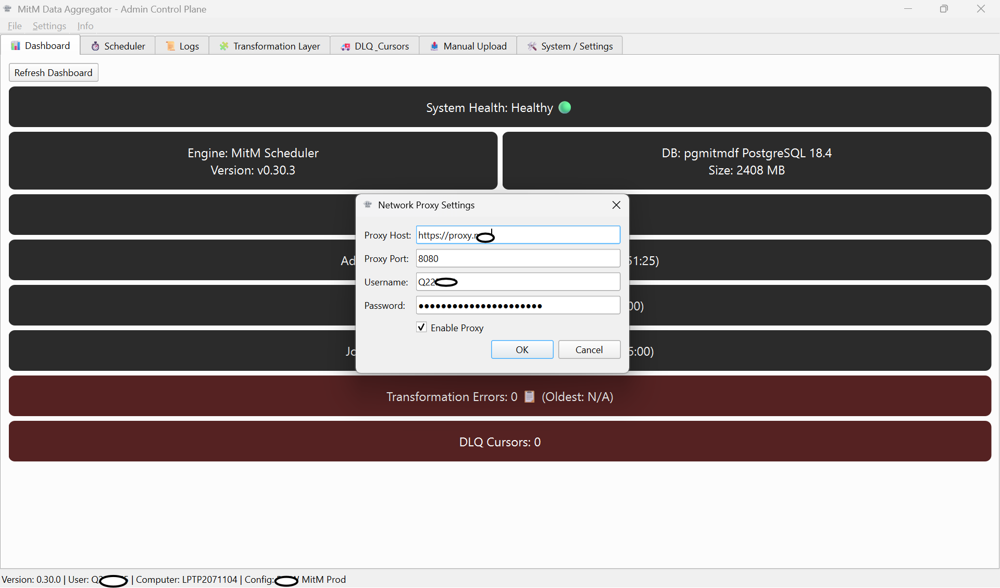

### Umgebungen

Über die Umgebungsübersicht kann zwischen den verschienen Umgebungen gewechselt werden.

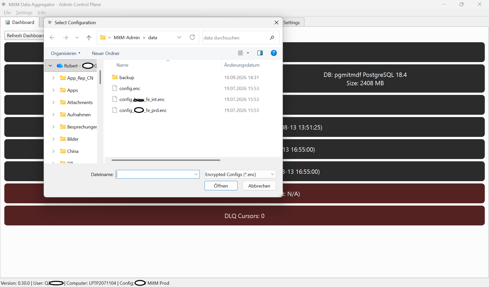

### Info und Aktualisierung

Der Info-Dialog zeigt Produktname, Version, Lizenz und Copyright. Bei einer verfügbaren
Aktualisierung wird ein entsprechender Hinweis angezeigt.

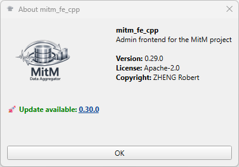

Der Dialog bestätigt alternativ, dass bereits die aktuelle Version verwendet wird.

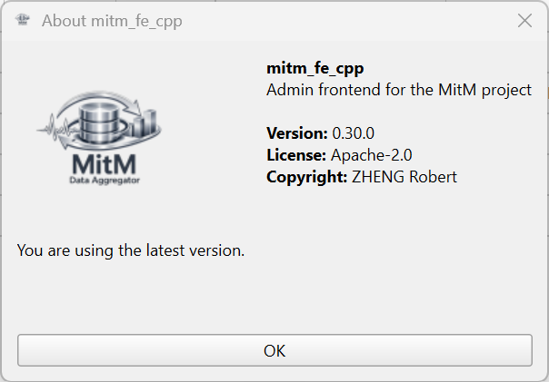

### Integrierte Hilfe

Der User Guide erläutert die Funktionen der Desktop Applikation.

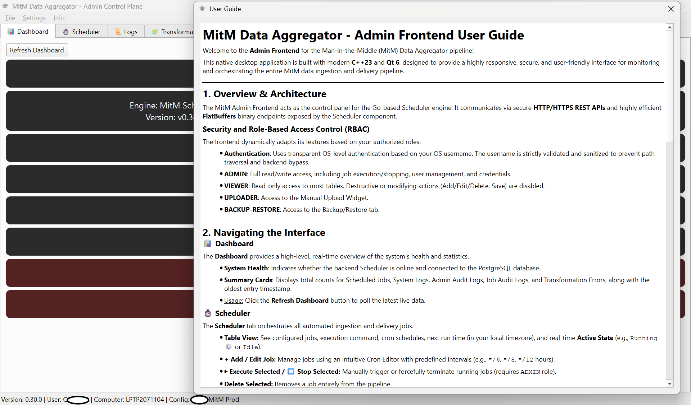

## Scheduler und manueller Upload

### Scheduler-Übersicht

Die Scheduler-Ansicht listet Jobs mit Befehl, Cron-Ausdruck, Aktivierungsstatus,
nächstem Ausführungszeitpunkt und aktuellem Laufstatus auf.

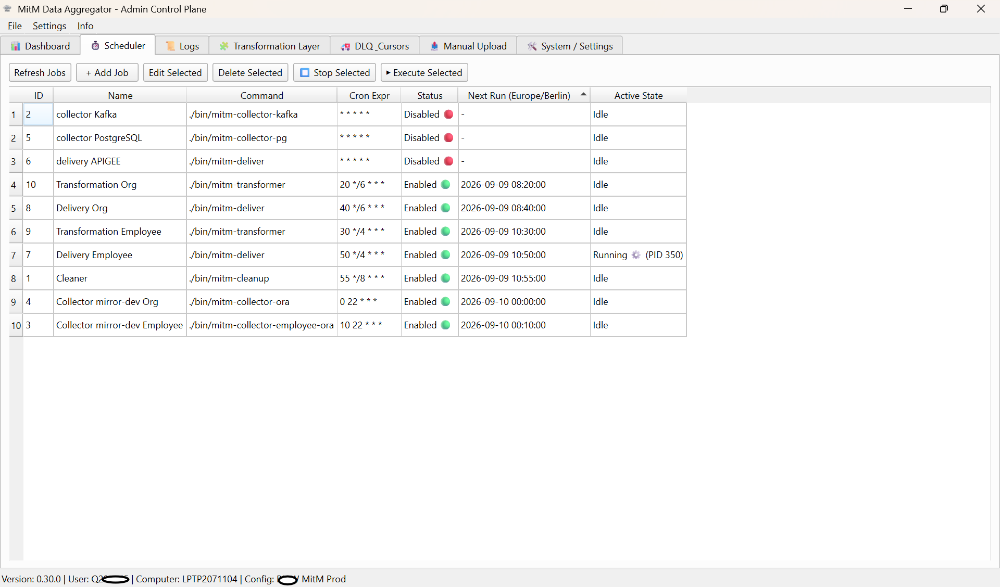

Die aktualisierte Übersicht erlaubt außerdem, ausgewählte Jobs direkt auszuführen oder
anzuhalten.

### Job bearbeiten

Im Bearbeitungsdialog werden Name, Befehl, JSON-Argumente, Aktivierung und der
Cron-Zeitplan eines Jobs verwaltet.

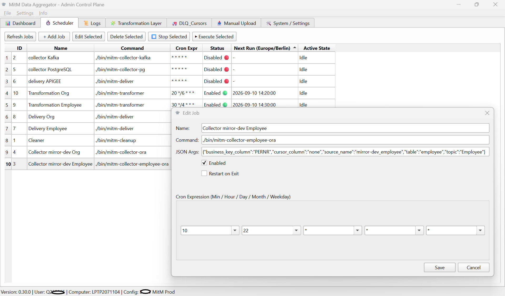

### Manueller Datei-Upload

Benutzer mit der Rolle `UPLOADER` können CSV- oder XLSX-Dateien für ein Topic auswählen
und den zugehörigen Collector unmittelbar starten.

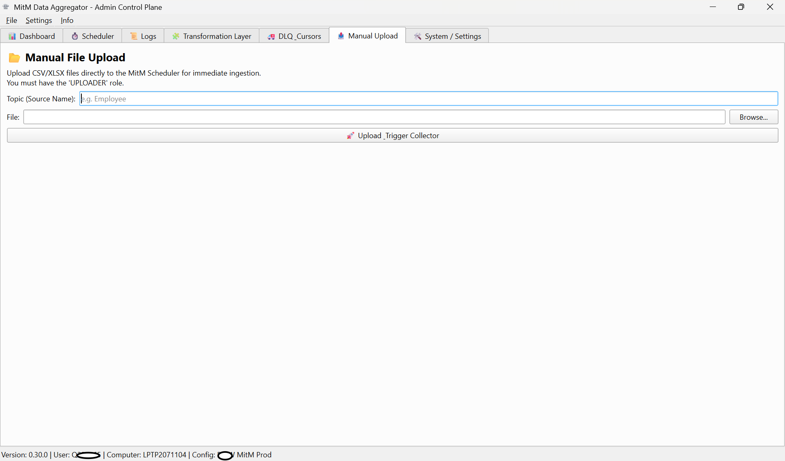

## Protokolle und Zustellung

### Job-Protokolle

Die Job-Protokolle dokumentieren Ausführungen nach Zeitraum, Run-ID und Komponente.
Sie können als CSV-Datei oder Bericht exportiert werden.

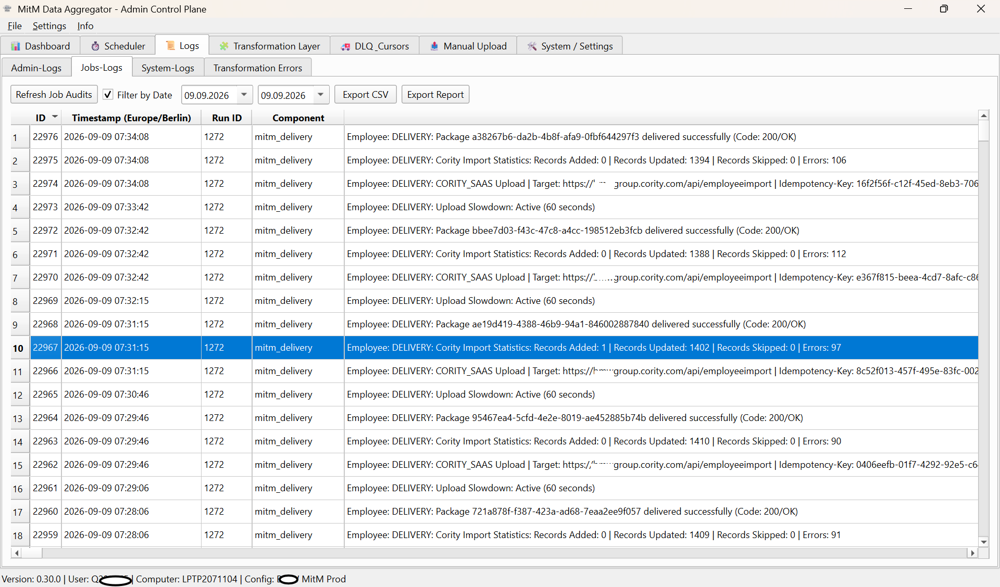

### Berichts-Export

Der Berichts-Export grenzt die auszuwertenden Zustellvorgänge über Job, Topic sowie
Start- und Enddatum ein.

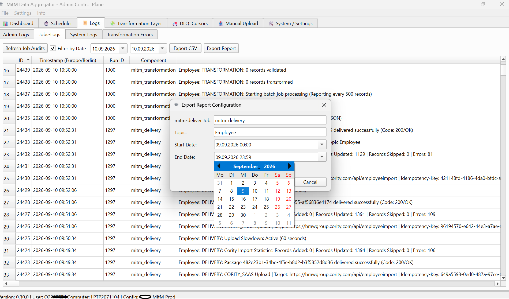

### Erfolgreiche Zustellung

Die Ansicht zeigt eine erfolgreiche Zustellung an den Zielendpunkt mit HTTP-Status
`200 (OK)` und einer erfolgreichen Importverarbeitung.

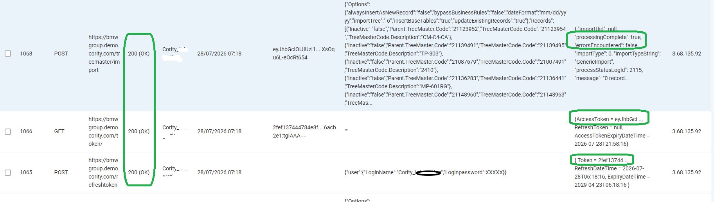

### Fehlerhafte Zustellung

Diese Aufnahme dokumentiert die Analyse von Antwortstatus und Token-Daten bei einer
fehlerhaften oder zu untersuchenden Zustellung.

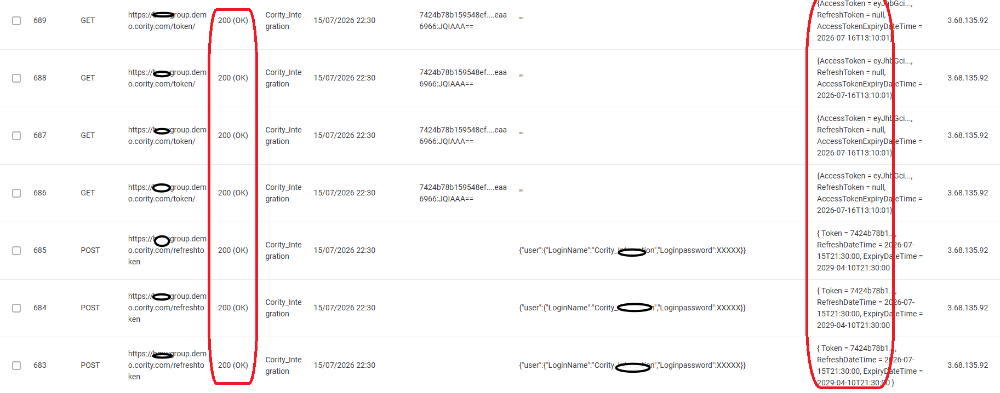

### Unverschlüsselte Übertragung

Die Aufnahme hält einen Fall fest, in dem eine Übertragung ohne Verschlüsselung
betrachtet wird.

## Transformationen und Zielstruktur

### Ziel-Felder

Die Liste der Ziel-Felder enthält Topic, Feldname, Datentyp sowie Kennzeichnungen für
Pflichtfelder und Verschlüsselung.

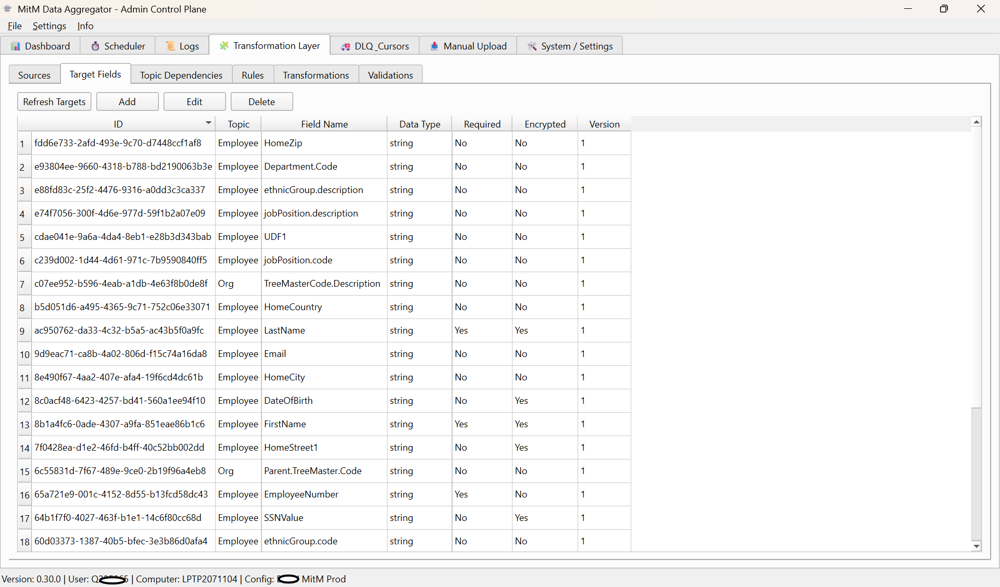

### Ziel-Feld bearbeiten

Im Bearbeitungsdialog lassen sich Topic, Feldname, Datentyp, Pflichtstatus und
Verschlüsselung eines Ziel-Feldes festlegen.

### Zuordnungsregeln

Die Regelübersicht ordnet Quellfelder Ziel-Feldern zu und zeigt Priorität sowie
Transformations- und Validierungsketten.

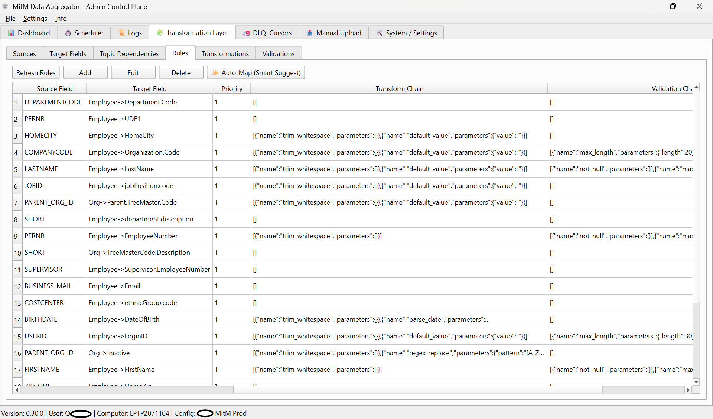

### Transformationen konfigurieren

Der Regel-Editor bietet einen Builder für Transformationsketten, beispielsweise zum
Bereinigen von Leerzeichen, Ändern der Groß-/Kleinschreibung oder Umwandeln von Typen.

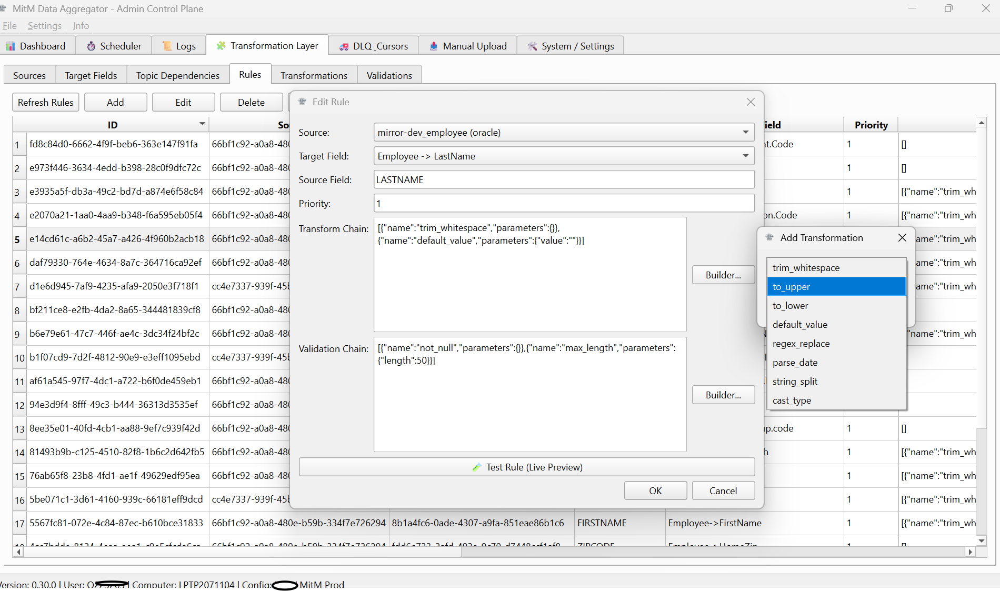

### Validierungen konfigurieren

Im selben Editor können Validierungen wie Pflichtfeldprüfung, E-Mail-Prüfung,
Mustervergleich sowie Längen- und Wertebereichsprüfungen ergänzt werden.

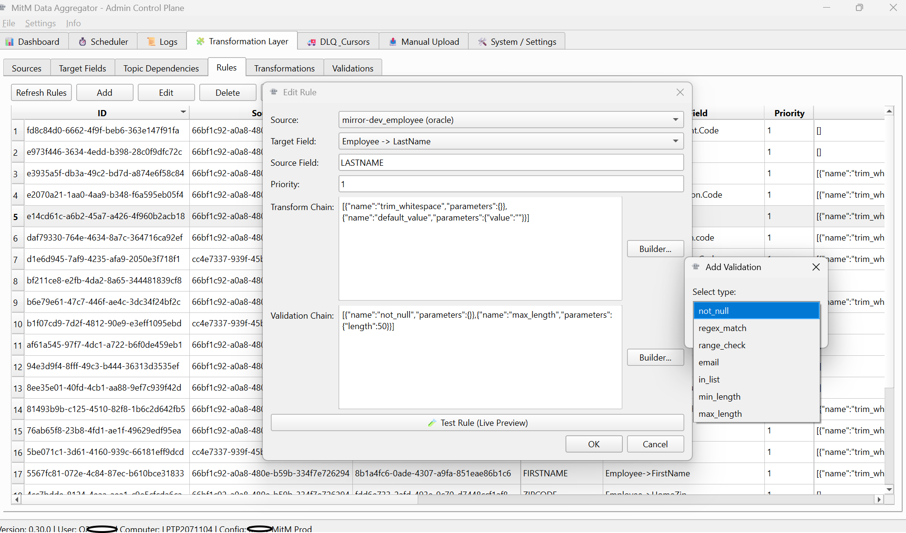

## Zugänge und Berechtigungen

### Quellzugänge

Die Verwaltung der Quellzugänge zeigt konfigurierte Connectoren, Topics und ihren
Aktivierungsstatus.

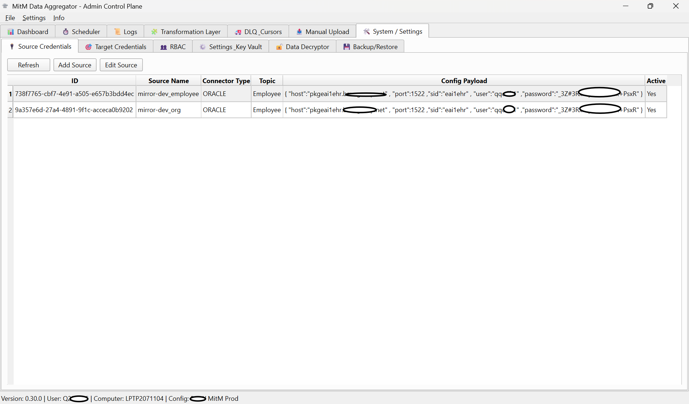

### Zielzugänge

Für Zielsysteme können Adaptertyp, Endpunkt und das zugehörige Konfigurations-Payload
pro Topic gepflegt werden.

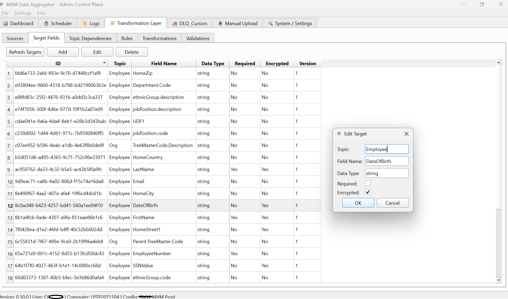

### Rollenverwaltung

Die RBAC-Verwaltung ordnet Benutzern Rollen wie `ADMIN`, `VIEWER`, `UPLOADER` und
`BACKUP-RESTORE` zu.

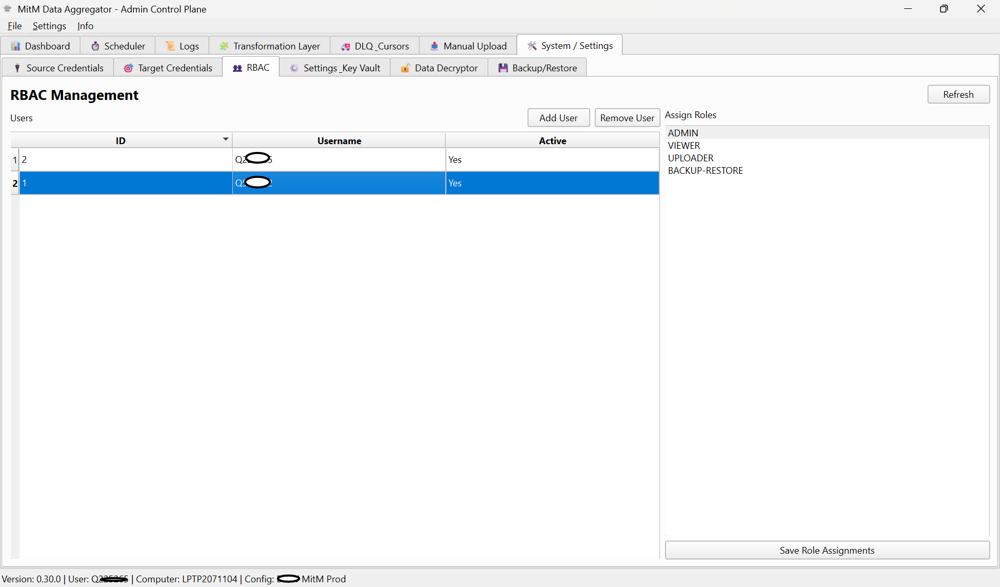

## Schlüsselverwaltung und Konfigurationssicherung

### Key Vault

Die Key-Vault-Ansicht zeigt den Sperrstatus und ermöglicht das Entsperren mit
Master-Key oder Windows Hello sowie die Rotation des Master-Keys.

Die leere Eingabemaske zeigt die vorgesehenen Schritte zum Entsperren und Erzeugen eines
neuen Master-Keys.

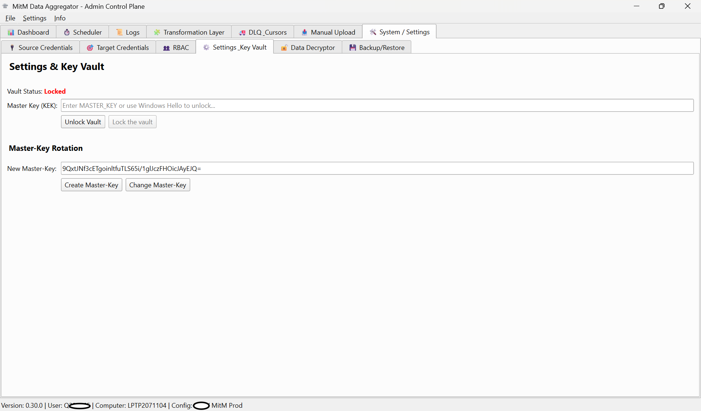

### Backup und Restore

Im Bereich Backup/Restore können Konfigurationen gesichert und wiederhergestellt werden.

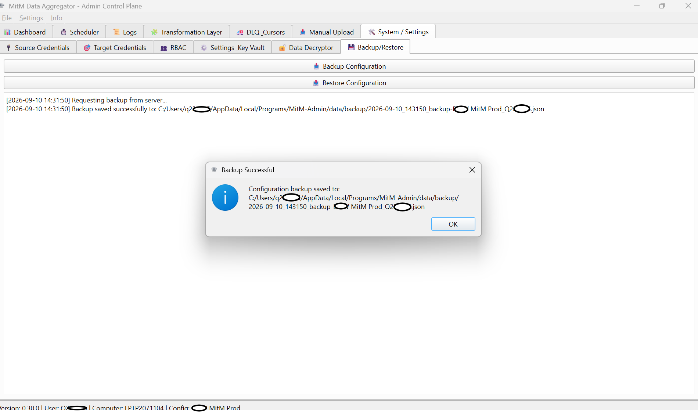

Nach einer erfolgreichen Sicherung bestätigt ein Dialog den Ablageort der erzeugten
Konfigurationsdatei.
