# MitM Admin Frontend - Linux Screenshots

This document showcases the graphical user interface of the **MitM Data Aggregator Admin Frontend** when running on a Linux desktop environment.

> [!NOTE]\
> This page is work in progress, content will be updated.

### 1. Application Startup

The initial prompt asking the user for the master password to decrypt the secure `config.enc` file via libsodium.
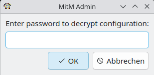

### 2. Dashboard View

The main dashboard displaying real-time system metrics, scheduler health, and an overview of active jobs.

**startup**

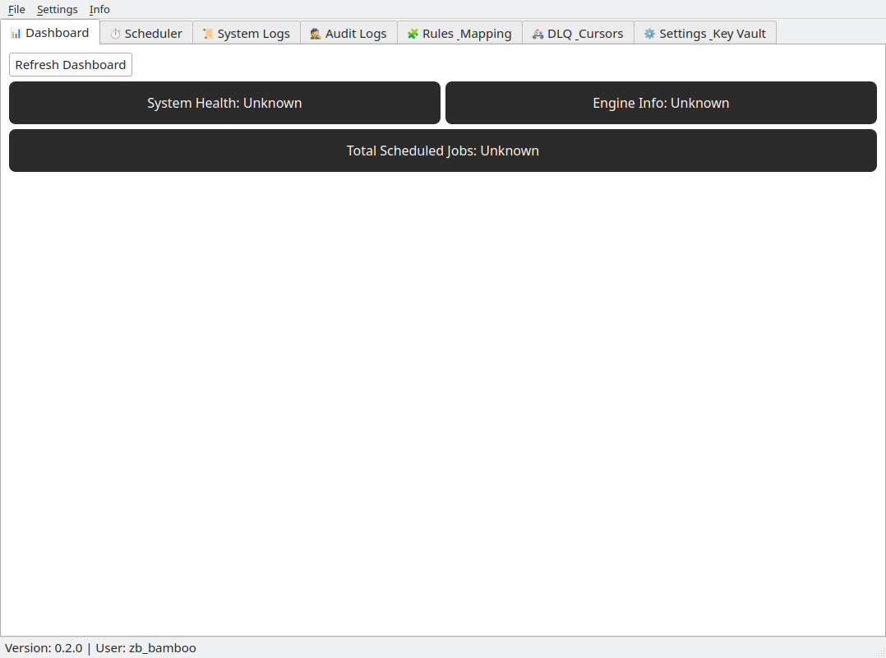

**running**

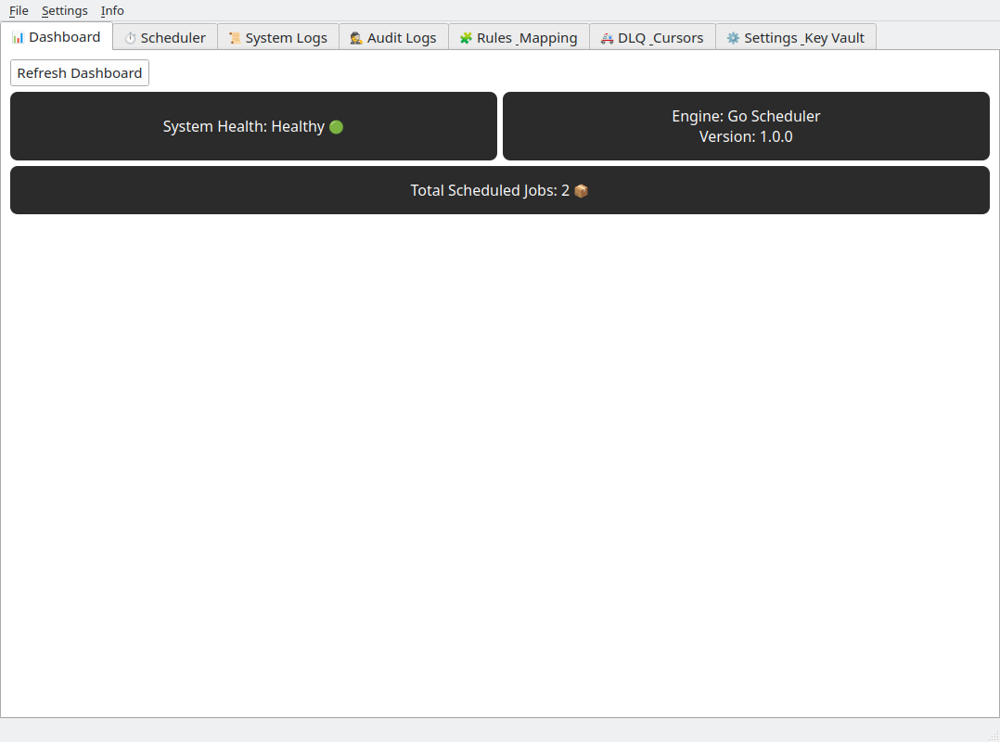

### 3. Network Proxy Setup

The per-user proxy configuration dialog accessible via the Settings menu, allowing secure HTTP/HTTPS proxy overrides.
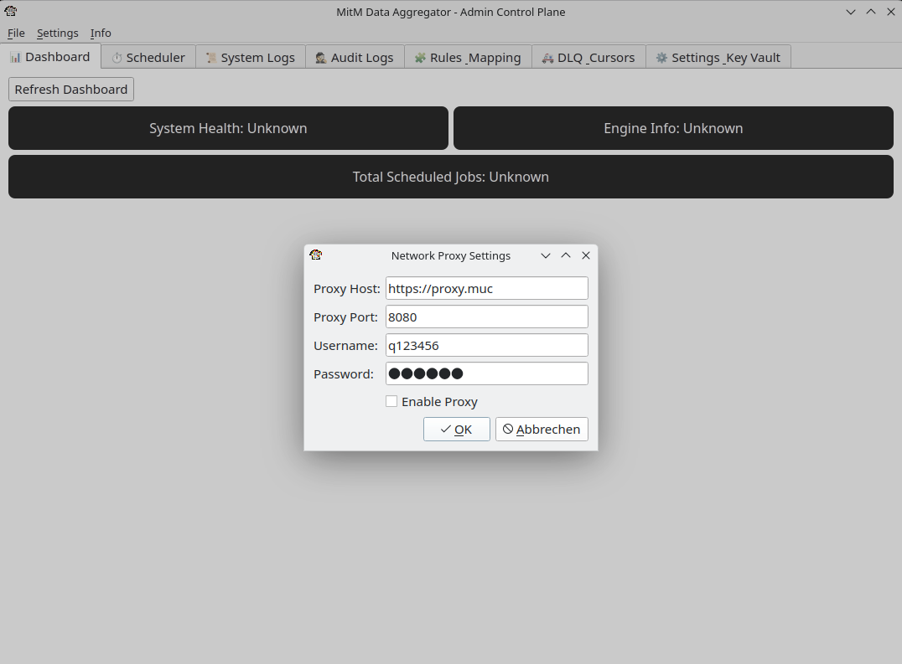

### 04. About Dialog

The "About" dialog displaying the current version, copyright information, and automatically checking for updates on GitHub.

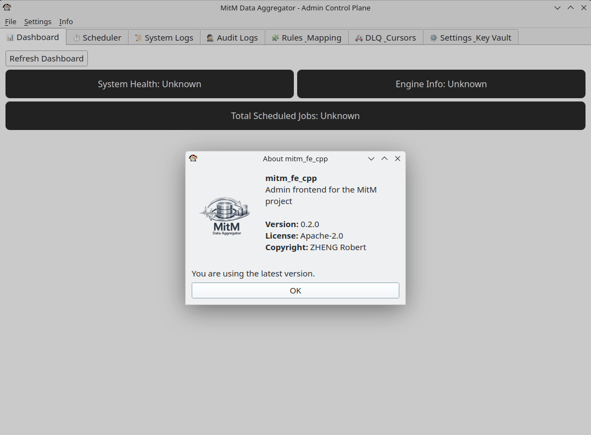

### 5. Scheduler Overview

The Scheduler tab listing all currently configured jobs, their cron schedules, and their last execution statuses.
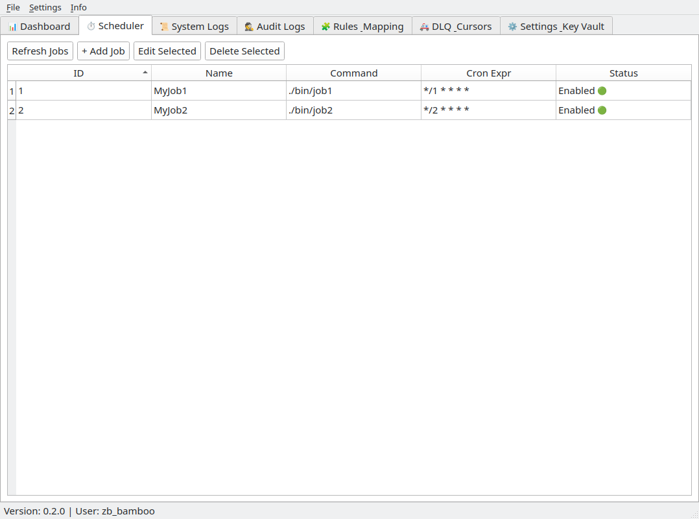

### 6. Job Editor & Cron

**Editing an existing job**, featuring the interactive Cron Expression editor for precise scheduling.
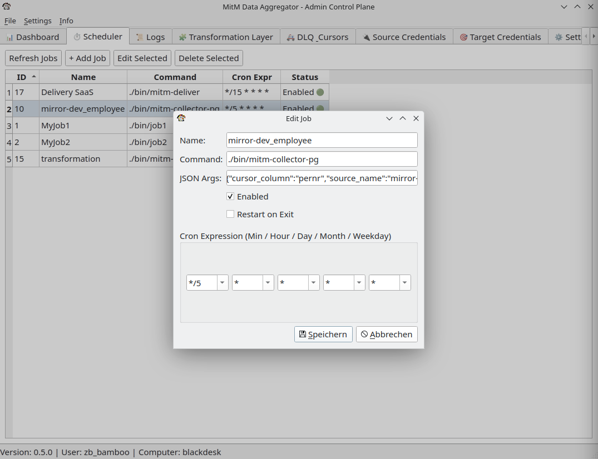

**Add Job**

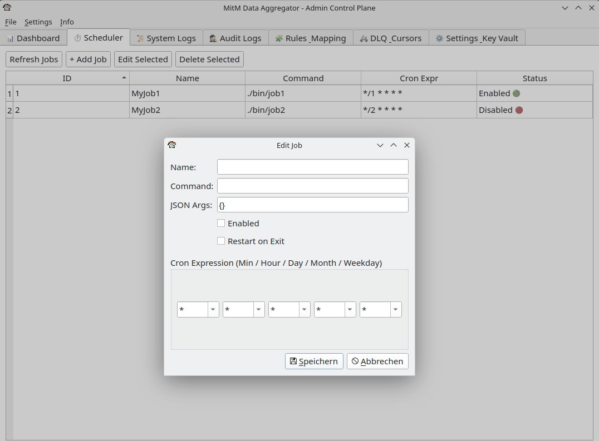

### 5. System Logs

The System Logs tab providing real-time log streaming from the backend with filtering capabilities. Columns are sortable. Log can be exported to a CSV file.
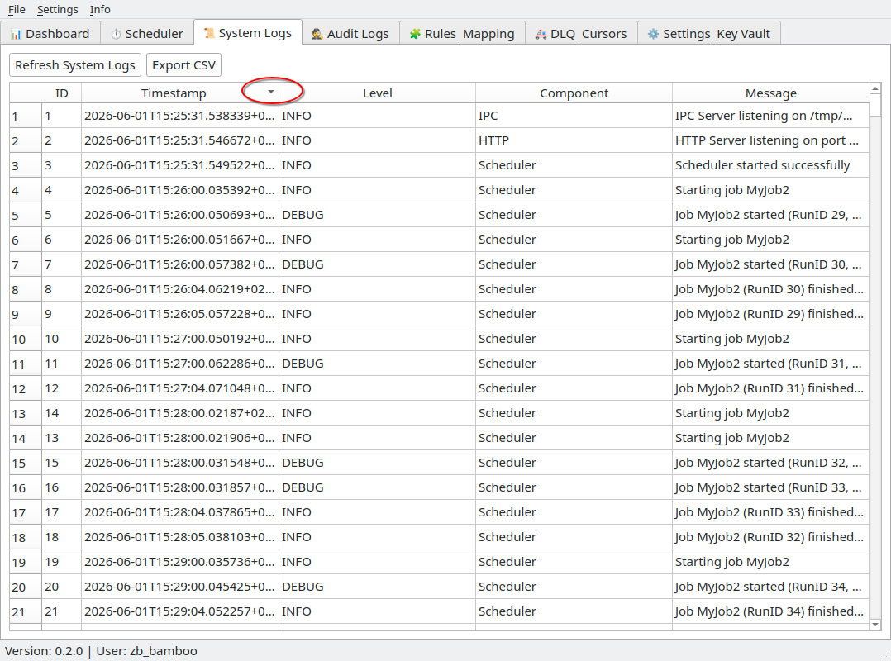

### 6. Audit Logs

Detailed audit logs tracking job execution histories and system changes. Columns are sortable. Log can be exported to a CSV file.
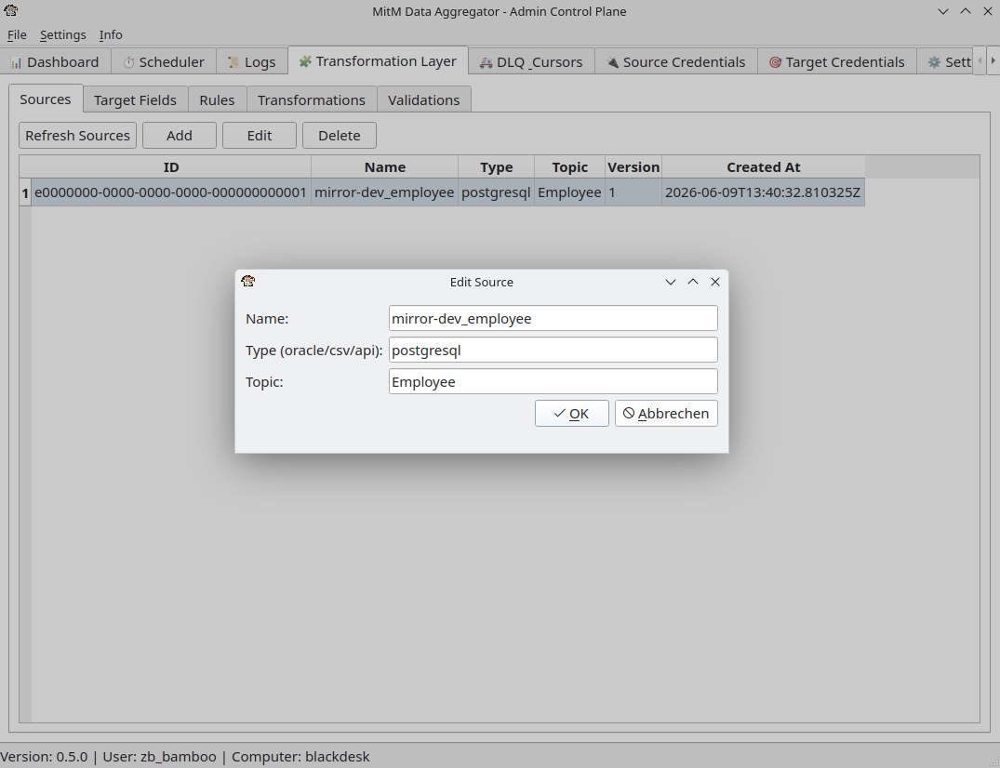

### 7. Rules & Mapping

The interface for defining and managing data transformation rules and field mappings. Columns are sortable.
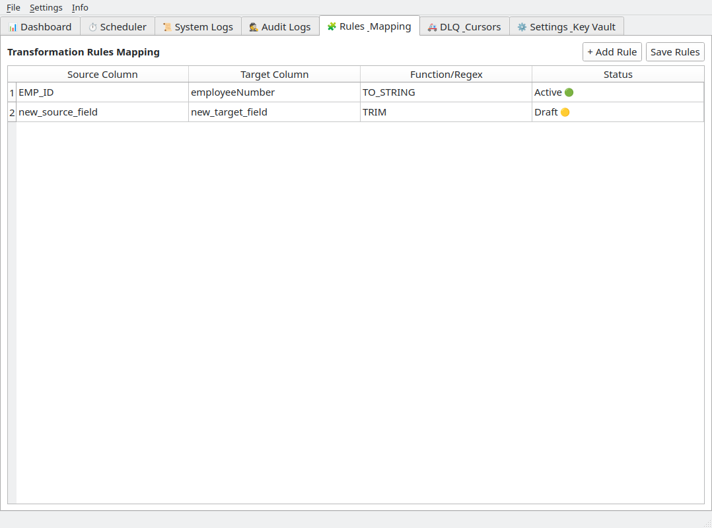

### 8. DLQ & Cursors

Monitoring the Dead Letter Queue (DLQ) for failed messages and managing system cursors.
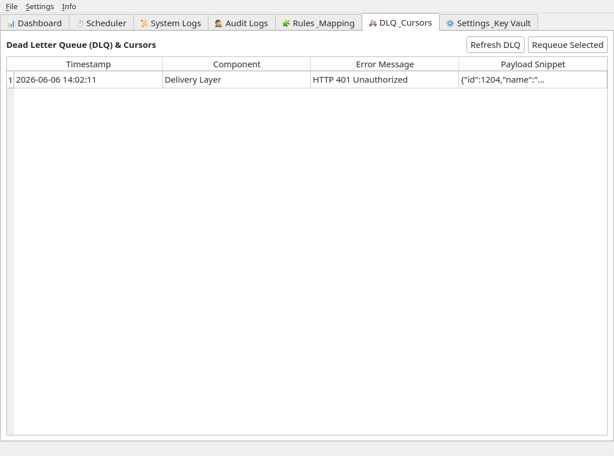

### 9. Settings & Key Vault

Configuration interface for securely injecting the Envelope Encryption master keys and managing backend connections.
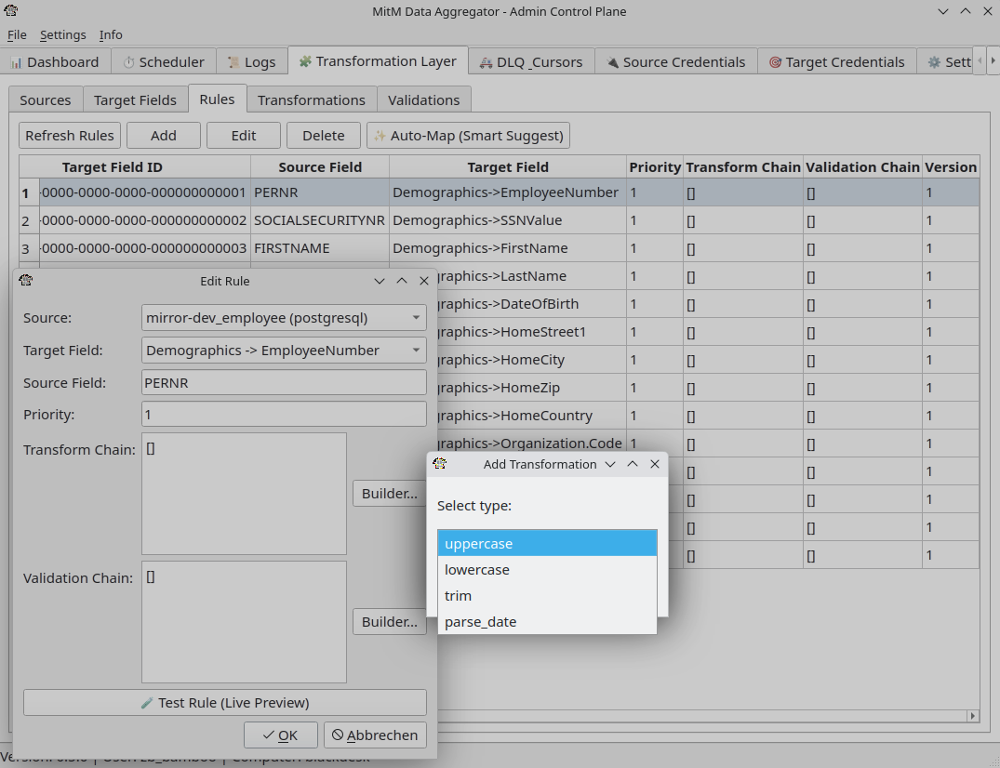
